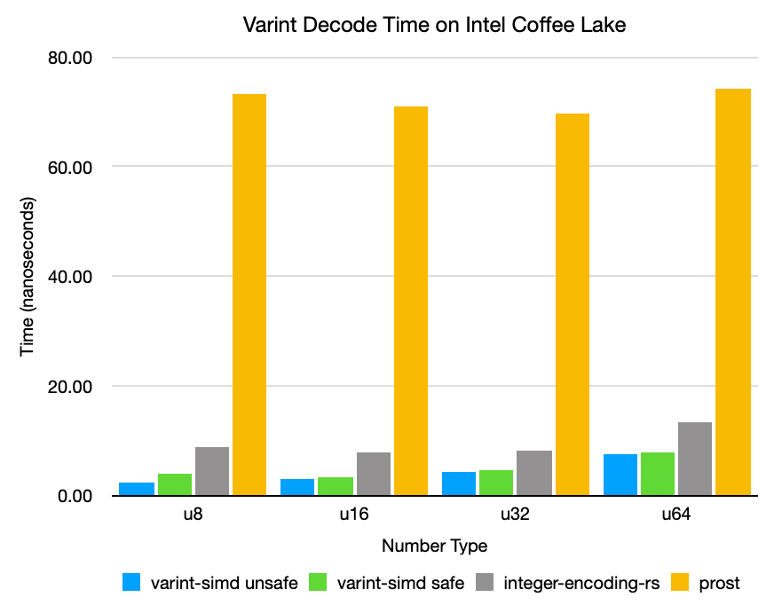

varint-simd
==

varint-simd is a fast SIMD-accelerated [variable-length integer](https://developers.google.com/protocol-buffers/docs/encoding) 
encoder and decoder written in Rust. It is intended for use in implementations of Protocol Buffers (protobuf), Apache
Avro, and similar serialization formats.

This library currently targets x86_64 processors with support for SSSE3 (Intel Core/AMD Bulldozer or newer), with 
optional optimizations for processors supporting POPCNT and LZCNT, and limited auto-vectorization for processors 
supporting AVX2. 

## Usage
**Important:** For optimal performance, ensure the Rust compiler has an appropriate `target-cpu` setting. An example is
provided in [`.cargo/config`](.cargo/config), but you may need to edit the file to specify the oldest CPUs your compiled
binaries will support.

```rust
use varint_simd::{encode, decode, encode_zigzag, decode_zigzag};

fn main() {
  let num: u32 = 300;
  
  let encoded = encode::<u32>(num); // turbofish for demonstration purposes, usually not necessary
  // encoded now contains a tuple
  // (
  //    [0xAC, 0x02, 0, 0, 0, 0, 0, 0, 0, 0, 0, 0, 0, 0, 0, 0], // encoded in a 128-bit vector
  //    2 // the number of bytes encoded
  // )
  
  let decoded = decode::<u32>(&encoded.0).unwrap();
  // decoded now contains another tuple:
  // (
  //    300, // the decoded number
  //    2 // the number of bytes read from the slice
  // )
  assert_eq!(decoded.0, num);
  
  // Signed integers can be encoded/decoded with convenience functions encode_zigzag and decode_zigzag
  let num: i32 = -20;
  let encoded = encode_zigzag::<i32>(num);
  let decoded = decode_zigzag::<i32>(&encoded.0).unwrap();
  assert_eq!(decoded.0, num);
}
```

The type parameter passed into the encode/decode functions greatly affects performance - the code takes shorter paths
for shorter integers, and may exhibit comparatively poor performance if you're decoding a lot of tiny integers 
into u64's.

## Safety
This crate uses *a lot* of unsafe code. Please exercise caution, although I do not expect there to be major issues.

There is also an optional "unsafe" interface for bypassing overflow and bounds checks. This can be used when you know 
your input data won't cause undefined behavior and your calling code can tolerate truncated numbers.

## Benchmarks
The benchmarks below reflect the performance of decoding and encoding a sequence of random integers bounded by each 
integer size. For more details, please see [the source code for these benchmarks](benches/varint_bench.rs).

### Intel Core i7-8850H "Coffee Lake" (2018 15" MacBook Pro)



#### Decode
|   | varint-simd unsafe | varint-simd safe | integer-encoding-rs | prost |
| -- | -- | -- | -- | -- |
| `u8`  | **2.27 ns** | **3.19 ns** | 8.68 ns | 73.3 ns |
| `u16` | **3.04 ns** | **3.88 ns** | 7.63 ns | 71.0 ns |
| `u32` | **4.30 ns** | **5.24 ns** | 8.26 ns | 69.7 ns |
| `u64` | **7.50 ns** | **8.68 ns** | 13.3 ns | 74.1 ns |

#### Encode
|   | varint-simd | integer-encoding-rs | prost |
| -- | -- | -- | -- |
| `u8`  | **2.79 ns** | 7.58 ns | 68.6 ns |
| `u16` | **3.39 ns** | 7.22 ns | 69.3 ns |
| `u32` | **4.37 ns** | 8.62 ns | 73.1 ns |
| `u64` | **5.88 ns** | 14.5 ns | 84.5 ns |

### AMD Ryzen 5 2600X @ 4.125 GHz "Zen+"
#### Decode
|   | varint-simd unsafe | varint-simd safe | integer-encoding-rs | prost |
| -- | -- | -- | -- | -- |
| `u8`  | **2.75 ns** | **3.48 ns** | 8.00 ns | 38.2 ns |
| `u16` | **3.34 ns** | **3.95 ns** | 7.54 ns | 35.6 ns |
| `u32` | **4.82 ns** | **5.10 ns** | 7.88 ns | 34.9 ns |
| `u64` | **6.94 ns** | **7.91 ns** | 13.4 ns | 40.0 ns |

#### Encode
|   | varint-simd | integer-encoding-rs | prost |
| -- | -- | -- | -- |
| `u8`  | **3.90 ns** | 7.53 ns | 63.4 ns |
| `u16` | **4.14 ns** | 7.26 ns | 64.3 ns |
| `u32` | **4.89 ns** | 8.50 ns | 64.0 ns |
| `u64` | **6.26 ns** | 14.1 ns | 76.4 ns |

## TODO
* Further optimization (I'm pretty sure I left some performance on the table)
* Support for ARM NEON
* Fallback scalar implementation
* Decode multiple varints in one call using AVX2 (currently implemented but with very poor performance, more work needed)

Contributions are welcome. 🙂

## License

Licensed under either of

* Apache License, Version 2.0
  ([LICENSE-APACHE](LICENSE-APACHE) or http://www.apache.org/licenses/LICENSE-2.0)
* MIT license
  ([LICENSE-MIT](LICENSE-MIT) or http://opensource.org/licenses/MIT)

at your option.

## Contribution

Unless you explicitly state otherwise, any contribution intentionally submitted
for inclusion in the work by you, as defined in the Apache-2.0 license, shall be
dual licensed as above, without any additional terms or conditions.
