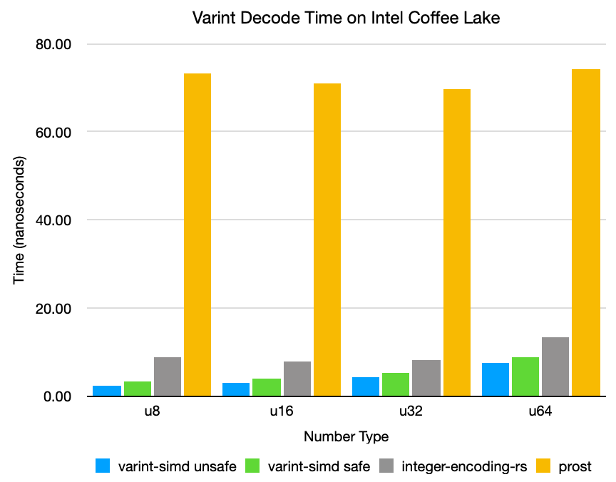

varint-simd
==
[](https://crates.io/crates/varint-simd)
[](https://docs.rs/varint-simd)
[](https://github.com/as-com/varint-simd/actions?query=workflow%3A%22Continuous+integration%22)

varint-simd is a fast SIMD-accelerated [variable-length integer](https://developers.google.com/protocol-buffers/docs/encoding) 
and [LEB128](https://en.wikipedia.org/wiki/LEB128) encoder and decoder written in Rust. It combines a largely branchless
design with compile-time specialization to achieve gigabytes per second of throughput encoding and decoding individual
integers on commodity hardware. An interface to decode multiple adjacent variable-length integers is also provided 
to achieve even higher throughput, reaching [over a billion decoded 8-bit integers per second](#benchmarks) on a single 
thread. 

This library currently targets a minimum of x86_64 processors with support for SSSE3 (Intel Core/AMD Bulldozer or 
newer), with optional optimizations for processors supporting POPCNT, LZCNT, BMI2, and/or AVX2. It is intended for use 
in implementations of Protocol Buffers (protobuf), Apache Avro, and similar serialization formats, but likely has many
other applications.

## Usage
**Important:** Ensure the Rust compiler has an appropriate `target-cpu` setting. An example is provided in
[`.cargo/config`](.cargo/config), but you may need to edit the file to specify the oldest CPUs your compiled
binaries will support. Your project will not compile unless this is set correctly. 

The `native-optimizations` feature should be enabled if and only if `target-cpu` is set to `native`, such as in the 
example. This enables some extra optimizations if suitable for your specific CPU. 
[Read more below.](#about-the-native-optimizations-feature)

```rust
use varint_simd::{encode, decode, encode_zigzag, decode_zigzag};

fn main() {
  let num: u32 = 300;
  
  let encoded = encode::<u32>(num); // turbofish for demonstration purposes, usually not necessary
  // encoded now contains a tuple
  // (
  //    [0xAC, 0x02, 0, 0, 0, 0, 0, 0, 0, 0, 0, 0, 0, 0, 0, 0], // encoded in a 128-bit vector
  //    2 // the number of bytes encoded
  // )
  
  let decoded = decode::<u32>(&encoded.0).unwrap();
  // decoded now contains another tuple:
  // (
  //    300, // the decoded number
  //    2 // the number of bytes read from the slice
  // )
  assert_eq!(decoded.0, num);
  
  // Signed integers can be encoded/decoded with convenience functions encode_zigzag and decode_zigzag
  let num: i32 = -20;
  let encoded = encode_zigzag::<i32>(num);
  let decoded = decode_zigzag::<i32>(&encoded.0).unwrap();
  assert_eq!(decoded.0, num);
}
```

The type parameter passed into the encode/decode functions greatly affects performance - the code takes shorter paths
for shorter integers, and may exhibit comparatively poor performance if you're decoding a lot of tiny integers 
into u64's.

## Safety
This crate uses *a lot* of unsafe code. Please exercise caution, although I do not expect there to be major issues.

There is also an optional "unsafe" interface for bypassing overflow and bounds checks. This can be used when you know 
your input data won't cause undefined behavior and your calling code can tolerate truncated numbers.

## Benchmarks
The benchmarks below reflect the performance of decoding and encoding a sequence of random integers bounded by each 
integer size. All benchmarks are run with native optimizations. 
For more details, please see [the source code for these benchmarks](benches/varint_bench.rs).

### Intel Core i7-8850H "Coffee Lake" (2018 15" MacBook Pro)



#### Decode
**All numbers are in millions of integers per second.**

|       |   varint-simd unsafe   |   varint-simd safe   | [rustc](https://github.com/nnethercote/rust/blob/0f6f2d681b39c5f95459cd09cb936b6ceb27cd82/compiler/rustc_serialize/src/leb128.rs) | [integer-encoding-rs](https://github.com/dermesser/integer-encoding-rs) | [prost](https://github.com/danburkert/prost) |
|-------|------------------------|----------------------|--------|---------------------|--------|
| `u8`  |             **554.81** |           **283.26** | 131.71 |              116.59 | 131.42 |
| `u16` |             **493.96** |           **349.74** | 168.09 |              121.35 | 157.68 |
| `u32` |             **482.95** |           **332.11** | 191.37 |              120.16 | 196.05 |
| `u64` |             **330.86** |           **277.65** | 82.315 |              80.328 | 97.585 |

|       | varint-simd 2x | varint-simd 4x | varint-simd 8x |
|-------|----------------|----------------|----------------|
| `u8`  |         658.52 |         644.36 |         896.32 |
| `u16` |         547.39 |         540.93 |                |
| `u32` |         688.11 |                |                |

#### Encode

|       |   varint-simd   | rustc  | integer-encoding-rs | prost  |
|-------|-----------------|--------|---------------------|--------|
| `u8`  |      **383.01** | 214.05 |              126.66 | 93.617 |
| `u16` |      **341.25** | 181.18 |              126.79 | 85.014 |
| `u32` |      **360.87** | 157.95 |              125.00 | 77.402 |
| `u64` |      **303.72** | 72.660 |              78.153 | 46.456 |

### AMD Ryzen 5 2600X @ 4.125 GHz "Zen+"
#### Decode

|       |   varint-simd unsafe   |   varint-simd safe   | rustc  | integer-encoding-rs | prost  |
|-------|------------------------|----------------------|--------|---------------------|--------|
| `u8`  |             **537.51** |           **304.85** | 152.35 |              138.54 | 124.44 |
| `u16` |             **403.39** |           **300.68** | 170.31 |              156.06 | 147.83 |
| `u32` |             **293.88** |           **235.92** | 160.48 |              159.13 | 150.05 |
| `u64` |             **229.28** |           **193.28** | 75.822 |              85.010 | 83.407 |


|       | varint-simd 2x | varint-simd 4x | varint-simd 8x |
|-------|----------------|----------------|----------------|
| `u8`  |         943.75 |         808.45 |       1,106.50 |
| `u16` |         721.01 |         632.03 |                |
| `u32` |         459.77 |                |                |

#### Encode

|       |   varint-simd   | rustc  | integer-encoding-rs | prost  |
|-------|-----------------|--------|---------------------|--------|
| `u8`  |      **362.97** | 211.07 |              142.16 | 98.237 |
| `u16` |      **334.10** | 172.09 |              140.78 | 96.480 |
| `u32` |      **288.19** | 101.56 |              126.27 | 82.210 |
| `u64` |      **207.89** | 52.515 |              79.375 | 48.088 |

## TODO
* Encoding multiple values at once
* Faster decode for two `u64` values with AVX2 (currently fairly slow)
* Improve performance of "safe" interface
* Parallel ZigZag decode/encode
* Support for ARM NEON
* Fallback scalar implementation
* Further optimization (I'm pretty sure I left some performance on the table)

Contributions are welcome. 🙂

## About the `native-optimizations` feature

This feature flag enables a build script that detects the current CPU and enables PDEP/PEXT optimizations if the CPU
supports running these instructions efficiently. It should be enabled if and only if the `target-cpu` option is set to 
`native`.

This is necessary because AMD Zen, Zen+, and Zen 2 processors implement these instructions in microcode, which means
they run much, much slower than if they were implemented in hardware. Additionally, [Rust does not allow conditional
compilation based on the `target-cpu` option](https://github.com/rust-lang/rust/issues/44036), so it is necessary to 
specify this feature manually.

Library crates **should not** enable this feature by default. A separate feature flag should be provided to enable this
feature in this crate. 

## Previous Work

* Daniel Lemire, Nathan Kurz, Christoph Rupp - Stream VByte: Faster Byte-Oriented Integer Compression, Information Processing Letters 130, 2018: https://arxiv.org/abs/1709.08990
* Jeff Plaisance, Nathan Kurz, Daniel Lemire - Vectorized VByte Decoding, International Symposium on Web Algorithms, 2015: https://arxiv.org/abs/1503.07387

## License

Licensed under either of

* Apache License, Version 2.0
  ([LICENSE-APACHE](LICENSE-APACHE) or http://www.apache.org/licenses/LICENSE-2.0)
* MIT license
  ([LICENSE-MIT](LICENSE-MIT) or http://opensource.org/licenses/MIT)

at your option.

## Contribution

Unless you explicitly state otherwise, any contribution intentionally submitted
for inclusion in the work by you, as defined in the Apache-2.0 license, shall be
dual licensed as above, without any additional terms or conditions.
